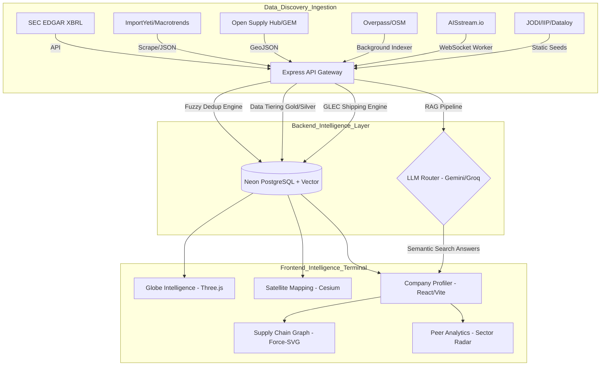

# ◎ GreenOrb v3 — Open Carbon Intelligence Platform

GreenOrb is an AI-powered carbon intelligence platform that gives anyone access to real, verifiable CO₂ data for countries, companies, and products. Built with React + Vite, powered by Google Gemini AI and a decentralized agentic backend.

---

## 🏗️ System Architecture

```mermaid
graph TD
    subgraph Data_Discovery_Ingestion
        S1[SEC EDGAR XBRL] --> |API| B
        S2[ImportYeti/Macrotrends] --> |Scrape/JSON| B
        S3[Open Supply Hub/GEM] --> |GeoJSON| B
        S4[Overpass/OSM] --> |Background Indexer| B
        S5[AISstream.io] --> |WebSocket Worker| B
        S6[JODI/IIP/Dataloy] --> |Static Seeds| B
    end

    subgraph Backend_Intelligence_Layer
        B[Express API Gateway] --> |Fuzzy Dedup Engine| DB
        B --> |Data Tiering Gold/Silver| DB
        B --> |GLEC Shipping Engine| DB
        DB[(Neon PostgreSQL + Vector)]
        B --> |RAG Pipeline| AI
        AI{LLM Router - Gemini/Groq}
    end

    subgraph Frontend_Intelligence_Terminal
        U1[Globe Intelligence - Three.js]
        U2[Satellite Mapping - Cesium]
        U3[Company Profiler - React/Vite]
        U4[Supply Chain Graph - Force-SVG]
        U5[Peer Analytics - Sector Radar]
    end

    DB --> U1
    DB --> U2
    DB --> U3
    U3 --> U4
    U3 --> U5
    AI --> |Semantic Search Answers| U3
```

### Information Architecture (Data Pillars)
1. **Financial Layer**: SEC EDGAR XBRL facts, Macrotrends 10-year revenue history.
2. **Production Layer**: GEM industrial facility mapping, Open Supply Hub IDs, national IIP production indices.
3. **Environmental Layer**: Scope 1/2/3 verified data (BRSR PDFs), Climate TRACE spatial assets.
4. **Logistics Layer**: AISstream.io live maritime tracking, GLEC-compliant shipping emission modeling.
5. **Regulatory Layer**: CBAM liability estimation, CA100+ CarbonTracker climate alignment.

### Collaborative Agent Workflow
GreenOrb operates through a 4-agent network described in `AGENTS.md`:
*   **🔍 Scout Agent (Discovery)**: Identifies 2024/2025 ESG reports and extracts initial carbon footprints.
*   **📊 Analyst Agent (Diligence)**: Deep-scans reports to score E, S, and G metrics numerically.
*   **⚠️ Risk Agent (Verification)**: Detects Greenwashing, regulatory gaps, and reporting inconsistencies.
*   **💡 Strategy Agent (Insights)**: Recommends investment/policy actions (BUY/HOLD/AVOID) based on aggregate risk.

---

## 🛰️ Data Extraction & Ingestion Methodology

### 1. Safe Block-Level PDF Layout Parsing
Instead of raw line splitting, GreenOrb utilizes PyMuPDF's coordinate-aware block extraction (`page.get_text("blocks")`) to isolate paragraphs natively layout-by-layout. 
- **Domain-Specific Budgets**: Paragraphs are dynamically scored for relevance and assigned to exclusive single-domain budgets (Emissions, Financials, and Operations) to prevent context duplication.
- **Global Deduplication**: A global tracking engine ensures text elements never pollute multiple categories.

### 2. Direct Local Processing & Self-Healing Parser
To ensure zero rate limits (429s), the platform supports a 100% free offline mode running Local Llama 3 (via Ollama) with:
- **Intelligent Sliding Window**: Context is distributed dynamically based on document depth (e.g., pulling emissions from the back of the report and financials from the front).
- **Self-Healing Bracket Balancer**: Reconstructs incomplete or truncated JSON payloads on-the-fly by balancing bracket state and quote boundaries.
- **Predict Token Optimization**: Configured to `2048` predict tokens for robust, multi-pass structured output.

### 3. Automatic Unit Normalization
All metrics undergo deterministic scale normalization before PostgreSQL storage:
- **CO₂**: Auto-normalizes `ktCO₂e`, `MtCO₂e`, and thousand metric tons to standard Metric Tonnes (`tCO₂e`).
- **Energy**: Auto-converts Gigajoules (`GJ`), Terajoules (`TJ`), and `GWh` to standard Megawatt-hours (`MWh`).
- **Water**: Auto-normalizes Megaliters (`ML`) and million liters to standard cubic meters (`m³` / `kL`).

---

## 🛠 Tech Stack

*   **Frontend**: React 18, Vite 6, Three.js (3D Globe), Cesium (Satellite Maps).
*   **Backend**: Node.js (Express), Neon PostgreSQL (Serverless via WebSocket pool).
*   **AI Engine**: Dual-Model Consensus (Gemini 2.0 Flash + Groq Llama 3.3 70B) or 100% Offline Local Llama 3 (Ollama) with 8k context mapping.
*   **Logistics**: `ws` for maritime tracking, `GLEC Framework v3` for emissions.
*   **Workers**: Python watchers for continuous PDF ingestion and JSON normalization.

---

Built with ❤️ and data by the GreenOrb Team.
