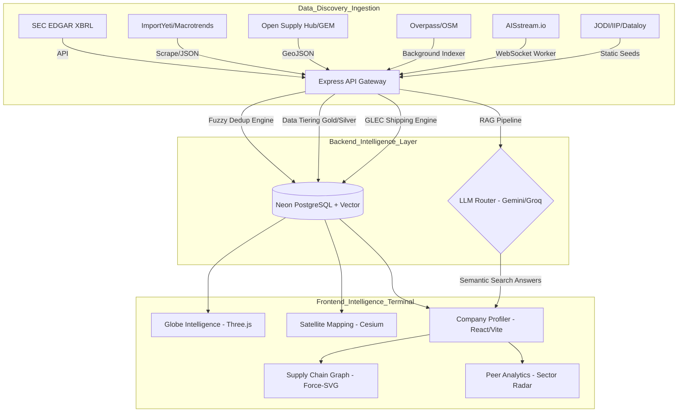

# ◎ GreenOrb v3 — Open Carbon Intelligence Platform

GreenOrb is an AI-powered carbon intelligence platform that gives anyone access to real, verifiable CO₂ data for countries, companies, and products. Built with React + Vite, powered by Google Gemini AI and a decentralized agentic backend.

---

## 🏗️ System Architecture

```mermaid
graph TD
    subgraph Data_Discovery_Ingestion
        S1[SEC EDGAR XBRL] --> |API| B
        S2[ImportYeti/Macrotrends] --> |Scrape/JSON| B
        S3[Open Supply Hub/GEM] --> |GeoJSON| B
        S4[Overpass/OSM] --> |Background Indexer| B
        S5[AISstream.io] --> |WebSocket Worker| B
        S6[JODI/IIP/Dataloy] --> |Static Seeds| B
    end

    subgraph Backend_Intelligence_Layer
        B[Express API Gateway] --> |Fuzzy Dedup Engine| DB
        B --> |Data Tiering Gold/Silver| DB
        B --> |GLEC Shipping Engine| DB
        DB[(Neon PostgreSQL + Vector)]
        B --> |RAG Pipeline| AI
        AI{LLM Router - Gemini/Groq}
    end

    subgraph Frontend_Intelligence_Terminal
        U1[Globe Intelligence - Three.js]
        U2[Satellite Mapping - Cesium]
        U3[Company Profiler - React/Vite]
        U4[Supply Chain Graph - Force-SVG]
        U5[Peer Analytics - Sector Radar]
    end

    DB --> U1
    DB --> U2
    DB --> U3
    U3 --> U4
    U3 --> U5
    AI --> |Semantic Search Answers| U3
```

### Information Architecture (Data Pillars)
1. **Financial Layer**: SEC EDGAR XBRL facts, Macrotrends 10-year revenue history.
2. **Production Layer**: GEM industrial facility mapping, Open Supply Hub IDs, national IIP production indices.
3. **Environmental Layer**: Scope 1/2/3 verified data (BRSR PDFs), Climate TRACE spatial assets.
4. **Logistics Layer**: AISstream.io live maritime tracking, GLEC-compliant shipping emission modeling.
5. **Regulatory Layer**: CBAM liability estimation, CA100+ CarbonTracker climate alignment.

### Collaborative Agent Workflow
GreenOrb operates through a 4-agent network described in `AGENTS.md`:
*   **🔍 Scout Agent (Discovery)**: Identifies 2024/2025 ESG reports and extracts initial carbon footprints.
*   **📊 Analyst Agent (Diligence)**: Deep-scans reports to score E, S, and G metrics numerically.
*   **⚠️ Risk Agent (Verification)**: Detects Greenwashing, regulatory gaps, and reporting inconsistencies.
*   **💡 Strategy Agent (Insights)**: Recommends investment/policy actions (BUY/HOLD/AVOID) based on aggregate risk.

---

## 🛰️ Data Extraction Methodology

### 1. Advanced PDF Extraction (Coordinate-Aware)
To achieve high accuracy on complex financial tables, GreenOrb uses a **Coordinate-Aware Table Reconstruction** engine:
*   **Spatial Parsing**: PDF text is parsed with (x, y) coordinates.
*   **Markdown Serialization**: Rows are reconstructed using pipe separators `|` to preserve column integrity.
*   **LLM Context**: The structured markdown is passed to Gemini 1.5 Flash, allowing it to correctly read multi-row cells and subtotals.

### 2. Satellite & Real-Time Flow
*   **Cloud-Free Mosaic**: Fetches Sentinel-2 metadata from CDSE, selecting the most recent date with `< 10%` cloud cover for local facility verification.
*   **AIS Vessel Tracking**: A persistent WebSocket worker connects to `stream.aisstream.io`, tracking vessels in major global maritime zones and caching positions in `vessel_positions`.

---

## 📐 Scientific Formulas & Logic

| Value | Formula / Logic |
|-------|----------------|
| **Logistics Score** | Inverse distance decay to nearest global port: `< 50km = 10`, `< 200km = 7`, `< 500km = 4`. |
| **Shipping Emissions** | `Distance (km) * Cargo (MT) * Emission Factor (GLEC WTW)`. |
| **Fuzzy Spatial Dedup** | `Haversine Distance < 500m` AND `Levenshtein Name Sim > 0.6` = MERGE. |
| **Greendex Score** | `(0.4 * E) + (0.3 * S) + (0.2 * G) + (0.1 * Trend_Signal)`. |
| **CBAM Liability** | `(Product_Tonnage * Embedded_Intensity) * (EU_ETS_Price - Home_Carbon_Price)`. |

---

## 🚦 Pre-set Rate Limits & Capacity

To ensure platform stability and budget control, the following limits are enforced:
*   **OpenStreetMap (Overpass)**: 10s cooldown between zone fetches per background worker.
*   **Dataloy Distances**: Strictly cached to 25 lifetime routes (Free Tier limit).
*   **SEC EDGAR**: Limited to 10 requests/sec as per SEC developer policy (handled by internal throttle).
*   **ImportYeti Scraping**: 7-day database cache per company to minimize scraping footprint.
*   **OSM Indexer**: Background job runs monthly (cron `@monthly`) via `osm-indexer.js`.

---

## 🛠 Tech Stack

*   **Frontend**: React 18, Vite 6, Three.js (3D Globe), Cesium (Satellite Maps).
*   **Backend**: Node.js (Express), Neon PostgreSQL (Serverless).
*   **AI Engine**: Google Gemini 1.5 Flash (via LLM Router for failover to Groq).
*   **Logistics**: `ws` for maritime tracking, `GLEC Framework v3` for emissions.
*   **Workers**: Node-cron for background spatial indexing and PDF ingestion queues.

---

Built with ❤️ and data by the GreenOrb Team.
