# ◎ GreenOrb v3 — Open Carbon Intelligence Platform

GreenOrb is an AI-powered carbon intelligence platform that gives anyone access to real, verifiable CO₂ data for countries, companies, and products. Built with React + Vite, powered by Google Gemini AI.


## 🌍 Features

| Tab | Description |
|-----|-------------|
| **Globe** | Interactive 3D globe (Three.js) — tap any country for verified CO₂ data, per-capita emissions, net zero targets, and forest offsets |
| **ESG DB** | 20+ companies with real ESG report links, Scope 1/2/3 breakdown, calculation methodology, and live AI search |
| **Compare** | Side-by-side LCA product comparison (smartphones, laptops, EVs, food) with source citations |
| **Scan** | Upload any PDF (invoice, ESG report, audit) — Gemini AI produces a full Greendex score + recommendations |
| **Agent** | Autonomous AI agent using Gemini + Google Search to continuously discover ESG reports and build a live carbon database |

## 🚀 Getting Started

### Prerequisites
- Node.js 18+
- A free [Google AI Studio API key](https://aistudio.google.com)

### Installation
```bash
git clone https://github.com/YOUR_USERNAME/greenorb.git
cd greenorb
npm install
```

### Configuration
Create a `.env` file in the root:
```env
VITE_GEMINI_KEY=your_gemini_api_key_here
```

### Run locally
```bash
npm run dev
```
Open [http://localhost:5173](http://localhost:5173)

## 🛠 Tech Stack

- **React 18** + **Vite 6** — fast modern toolchain
- **Three.js** — WebGL 3D globe rendering
- **Google Gemini 1.5 Flash** — AI analysis, web search grounding, PDF parsing
- **localStorage** — persistent ESG discovery database
- CSS Variables — zero-dependency dark theme design system

## 📁 Project Structure

```
src/
├── components/      # Shared UI: primitives, TopBar, BottomNav
├── data/            # Static datasets: countries, companies, products
├── tabs/            # GlobeTab, CompaniesTab, CompareTab, ScanTab, AgentTab
├── utils.js         # Gemini API wrapper, helpers, localStorage shim
└── styles/          # global.css (CSS variables + keyframes)
```

## 🏗️ Architecture & Workflows

### 4-Agent Collaborative Workflow

```mermaid
sequenceDiagram
    autonumber
    actor User
    participant UI as AgentTab UI
    participant Scout as 🔍 Scout Agent
    participant Analyst as 📊 Analyst Agent
    participant Risk as ⚠️ Risk Agent
    participant Strategy as 💡 Strategy Agent
    participant DB as Neon PostgreSQL

    User->>UI: Input Sector or Target (e.g., "Tech")
    UI->>Scout: Trigger Discovery phase
    
    activate Scout
    Note over Scout: Extracts raw CO2 data<br/>& sources reports
    Scout-->>UI: Return raw company data
    UI->>DB: UPSERT into companies table
    deactivate Scout

    par Diligence Phase
        UI->>Analyst: Send raw company data
        activate Analyst
        Note over Analyst: Deep-scans PDF,<br/>scores E-S-G
        Analyst-->>UI: Return detailed analysis
        UI->>DB: UPSERT into analysis table
        deactivate Analyst

        UI->>Risk: Send raw company data
        activate Risk
        Note over Risk: Checks greenwashing<br/>& compliance
        Risk-->>UI: Return risk factors
        UI->>DB: UPSERT into risks table
        deactivate Risk
    end

    UI->>Strategy: Send combined data (Raw + Analysis + Risk)
    activate Strategy
    Note over Strategy: Synthesizes findings<br/>into investment action
    Strategy-->>UI: Return final recommendation
    UI->>DB: UPSERT into strategies table
    deactivate Strategy

    UI-->>User: Display final aggregated results
```



### Database Schema (Neon PostgreSQL)


## 📊 Data Sources

- **Countries**: IEA, EPA, Global Carbon Project, UNFCCC inventories (2023)
- **Companies**: Official ESG/Sustainability Reports (linked in-app)
- **Products**: ISO 14040/14044 LCA data from manufacturer disclosures

## 🎯 Vision

> "Map 10M+ product carbon footprints · 500k+ companies · All 195 countries"

There is no single database of carbon footprints. ESG reports are scattered across thousands of PDFs. GreenOrb's AI agent reads them all.

---

Built with ❤️ and data by [@prawa](https://github.com/prawa)
